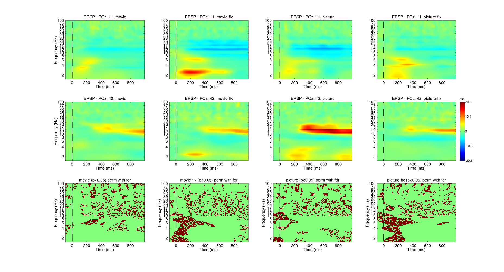

# Introduction

### State of the art EEG literature on mental imagery

- MVPA approach 

---

## Brain signal decoding and EEG

\begin{itemize}
  \item<+->MVPA applied to fMRI data: good for localisation of fine grained pattern of activation containing
   information about the stimulus/cognitive operation
  \item<+-> EEG allows to access the temporal dynamic of the cognitive operation

\end{itemize}

# Study design
### Protocol
  - Presentation of a natural stimulus followed by imagination
    of this stimulus
  - Stimuli are pictures or movie clips
  - 2 sémantic categories: animals and vehicules/urban
  - 2 recording sessions; 120 x 2 stim in each categories

### Hypothesis
  - effect over posterior electrodes

# Planned analysis
  - Can the classifier approach decodes between Perception vs Imagery
  - Animal vs Vehicules
  - Can a classifier trained on 
  - Time-frequency analysis and MVPA approach

# Preliminary results on 3 subjects

 

---

\includegraphics[width=0.6\columnwidth]{images/pz.png}

